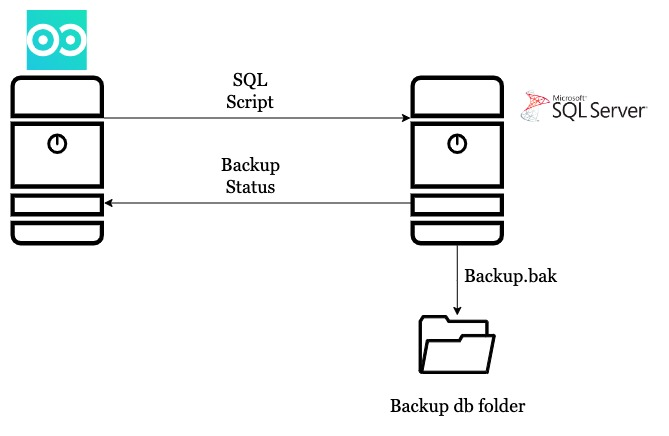
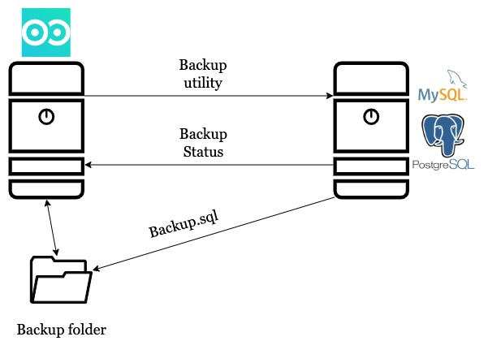

# Ratskt Walnut Backup

<!-- {:height="100px" width="100px"} -->


# Table of contents

- [Overview](#overview)
- [Requirements](#requirements)
- [Quick start](#quick-start)
- [Installation](#installation)
- [Configuration](#configuration)
    - [Settings reference](#settings-reference) 
    - [Crucial settings](#crucial-settings)
    - [Service management](#service-management)
- [Setting up a production service](#setting-up-a-production-service)
- [Usage](#usage)
    - [Access the application](#access-the-application)
    - [Main concepts](#main-concepts)
    - [DMS](#dms)
    - [Jobs](#jobs)
- [Troubleshooting](#troubleshooting)
- [License](#license)
- [Contacts](#contact)

# Overview
The **Ratsky Walnut** is a tool for **automatization and management of the backup** process of your SQL databases. It provides a simple and reliable way to backup your SQL databases on a **schedule or on-demand**, ensuring that you never lose critical data in the event of a system failure or data corruption.

The tool supports a wide range of SQL database platforms, including **MySQL**, **MariaDB**, **PostgreSQL**, and **Microsoft SQL Server**. 

The main goal of the project is to transform your backup routine to a pleasant experience. Project was inspired by [backup/backup project](https://github.com/backup/backup) and relies on default backuping mechanisms such as the pg_dump and mysqldump utilities.

### MSSQL
  

### PostgreSQL/MySQL
   


# Requirements

> Current version was tested on **Ubuntu Server 20.04 and higher**.

### Minimal hardware requirements:
- 1 CPU
- 2gb RAM
- 32gb HDD

### Suggested hardware requirements:
- 2 CPU
- 2gb RAM
- 64gb HDD

> Note: CPU requirements depend on your setup and amount of databases needed to be backuped at a time.

> Note: HDD requirements depend on size of all backups you want to store on localhost.

### Тhe following packages will be installed:

- python3 (>= 3.8)
- python3-distutils(>= 3.8)
- gcc(>= 9.4.0)
- libpq-dev(>= 12.14)
- postgresql(>= 12)
- redis(>= 5.0)
- rabbitmq-server(>= 3.8)
- mariadb-client(>= 10.0)
- postgresql-client(>= 12)
- libmariadb3(>= 10.3.22)
- libmariadb-dev(>=10.3.22)
- freetds-dev (>= 1.1)
- tdsodbc(>= 1.1)
- unixodbc(>=2.3.6)
- odbcinst(>=2.3.6)
- nginx(>=1.17)

# Quick start

- Download the deb package
    ```
    wget https://ra-sky.github.io/walnut/walnut_0.1-3.deb
    ```
- Install 
    ```
    sudo apt install -y ./walnut_0.1-3.deb
    ```
- Go to **https://{your_ip_address}/walnut/**
- Accept the self-signed certificate

> Default user credentials
> ```
> username: admin
> password: admin
> ```


# Installation
https://ra-sky.github.io/walnut
To install Ratsky Walnut backup utility:
- [Choose version](https://ra-sky.github.io/walnut/)
- Download deb package 
    ```
    wget https://ra-sky.github.io/walnut/walnut_{version}.deb
    ```
- Install 
    ```
    sudo apt install -y ./walnut_{version}.deb
    ```


## Configuration

> Note: configuration file **/etc/walnut/config.yaml**

You may skip [settings reference](#settings-reference) section and go right to [crucial settings](#crucial-settings)

### Settings reference

- **main** - the section describing app
  - **backup_base_path** - the path in OS where all backups will be stored
  - **database** - application internal database settings
    - **db_name** - database name
    - **host** - hostname where database located
    - **port** - port to access database
    - **username** - user to access database
    - **password** - user password
 -  **django** - walnut-django component settings
    - **base_url_path** - application additional uri (leave blank to access from /)  
    - **log** - django log settings
      - **level** - log level
      - **path** - log path
      - **rotation** - rotation size
  - **master** - walnut-master component settings
    - **log** - master log settings
      - **level** - log level
      - **path** - log path
      - **rotation** - rotation size
    - **max_worker** - number of async backups allowed at a time
  - **observer** - walnut-observer component settings
    - **log** -
      - **level** - log level
      - **path** - log path
      - **rotation** - rotation size
    - **max_apschedule_instances** - max scheduled jobs allowed
  - **rabbitMQ** - the application internal queue settings
    - **host** - the RMQ hostname/address
    - **port** - the RMQ port
    - **queue_name** - the name of queue to use
  - **redis** - application internal queue settings
    - **host** - the redis database hostname/address
    - **port** - the redis database port
  - **worker** - the walnut-worker component settings
    - **log** -
      - **level** - log level
      - **path** - log path
      - **rotation** - rotation size
- **secret** - a passphrase for security issues

<br>

Example
```
main:
  backup_base_path: /opt/walnut-backups
    username: walnut
  django:
    log:
      level: INFO
      path: /var/log/walnut/django.log
  observer:
    log:
      level: DEBUG
      path: /var/log/walnut/observer.log
      rotation: 50 MB
    max_apschedule_instances: 30
  master:
    log:
      level: DEBUG
      path: /var/log/walnut/master.log
      rotation: 50 MB
    max_worker: 5
  worker:
    log:
      level: DEBUG
      path: /var/log/walnut/worker.log
      rotation: 50 MB
  database:
    db_name: walnut
    host: localhost
    password: asjdhfjbvsu2737yf
    port: '5432'
  rabbitMQ:
    host: localhost
    port: '5672'
    queue_name: job_relay
  redis:
    host: localhost
    port: '6379'
secret: gJos1W972c4gLn9UqCvV0lfNp_AvjN988NnW44Ef6sg=
```

### Crucial settings


> Note: a.b.c = "Our variable" means
> ```
> .
> .
> a:
>     .
>     .
>     b:
>         .
>         .
>         c: "Our variable"
> ```

Some settings you should or might want to consider:

- **main.backup_base_path** - **path on localhost where all backups will be stored.** You can connect a network folder configured on the OS side at this path to increase the data storage reliability."
- **main.observer.max_apschedule_instances** - **number of scheduled jobs available.** Keep in mind that each additional instance of the **scheduler consumes system resources such as CPU and memory**, so setting this value too high might lead to performance issues. It is recommended to start with a low value, monitor system resources and increase the value as needed. **Default value - 30**.
- **secret** - **the phrase is used for symmetric encryption of the target database password.** It is initialized during installation. After adding jobs, it **should not be changed**, as the passwords of the targeted databases will become unavaliable.

> Note: you can restore the application database from the dump while keeping the same **secret**. 

---


## Setting up a production service


Once you have installed the software, you may want to set it up as a production service. Default installation uses several assumptions for a quick start. We **highly recommend** you to read and take necessary action **before productional usage**.

You may skip the following section and [explore our application](#access-application) right away. **Just make sure to come back and read the following section later.**

### Nginx

Nginx config customization is recommended.
**Default config was made for exploration services only.**

In the initial startup we use a self-singed certificate with "walnut.ratsky.local" DN. Feel free to use private.key file since it is generated on your localhost during installation.

**We suggest that you replace the certificate with one of your own.**

> Note: key and certificate path -> **/etc/nginx/certs/**

> If you would like to change the default walnut nginx path , verify your **main.django.base_url_path** setting

### Others

Following services should be accessed **only** from the localhost:
- Redis
- RabbitMQ
- PostgreSQL

We suggest changing the password for walnut user on all services listed above.

> Note: Ratsky Walnut was designed to work **inside local network only**

## Service management

Some frequent application structure concepts. If you are interested in application structure, feel free to [contact us](#contact).
<br>
The application consists of the three main components:
- walnut-django
- walnut-observer
- walnut-master

And four additional components:
- postgresql
- redis
- rabbitmq
- nginx

For correct application usage all component should be running.

To manipulate all main Walnut components at the same time use the walnut.target.
```
sudo systemctl start walnut.target
```
**Restart** and **stop** actions are also allowed. However you cannot see the status of application via the walnut.target

Alternatively, you can manipulate application via the walnut-django.service, the walnut-observer.service and the walnut-master.service

<br>

# Usage
## Access the application

Right after the installation you should be able to access the application from the browser
**https://{your_ip_address}/walnut/** unless you change nginx configuration.

The Default certificate will not be valid. To explore the application accept certificate. Just make sure to come back to [setting up production section](#setting-up-a-production-service).

First access:
```
username: admin
password: admin
```

> Right after the first login navigate to Settings -> Users
<br>**Create** new user **or change** admin password at least

## Main concepts

Ratsky Walnut allows you to set up various backup flows.
<br>
Main concept of manipulating your backup strategy includes two profiles.
- DMS profile - the profile describing how to connect to specified DMS
- Job profile - the profile describing backup parameters


### DMS

To configure a DMS profile, go to the DMS page, click 'Add DMS' button and fill out the following sections:

- Type - mssql/postgres/mysql
- Version (could be blank) 
- Host - network accessible hostname or ip
- Port - a port to access DMS
- Username - user with right permissions
- Password - user's password

> Note: DMS should be accessible from Ratsky Walnut host

> Note: User should be able to READ (PostgreSQL/MySQL) or have BACKUP permissions (MSSQL) 

### Jobs

After configuring DMS profile, Jobs can be added:

- Name - a job name. Must be unique.
- Database name - name of the database in DMS to be backuped. Word "all" can be used to backup all databases in the selected DMS.
- Action - currently only backup action is allowed.
- DMS - a DMS profile.
- Frequency - a cron schedule expression.
- Rotation - the number of backups stored.

# Troubleshooting

# License

Copyright Disclaimer:

Ratsky Walnut is the application developed by Shvora Nikita and Livitsky Andrey, licensed under the GNU General Public License version 3.0 (GPL 3.0).

All source code, design, and other intellectual property rights of Ratsky Walnut, including but not limited to text, graphics, logos, images, and software, are the property of the authors and contributors of the respective open source projects, and are protected by international copyright laws.

The information provided by Ratsky Walnut is for general informational purposes only and cannot be reproduced, distributed, or transmitted in any form or by any means without the prior written permission of the authors and contributors of the respective open source projects. Unauthorized use of any content on this app is strictly prohibited and may result in legal action.

Ratsky Walnut is licensed under the GNU General Public License version 3.0 (GPL 3.0), which provides users with the freedom to run, copy, distribute, study, change, and improve the software. However, the authors and contributors of the respective open source projects make no representations or warranties of any kind, express or imply, the completeness, accuracy, reliability, suitability, or availability of the app or the information, products, services or related graphics contained in the app for any purpose. Any reliance you place on such information is therefore strictly at your own risk.

In no event will the authors and contributors of the respective open source projects be liable for any claim, damages, or other liability, whether in an action of contract, tort, or otherwise, arising from, out of, or in connection with the app or the use or other dealings in the app.

For more information on the GPL 3.0 license, consult the [LICENSE file](LICENSE) included with the app.

All third party license agreements could be found in the third_party_licenses directory.

All rights reserved. 

# Contact

If you have any questions or feedback about the Ratsky Walnut, please contact us at rbsm33g0u@mozmail.com. We would be pleased to receive your feedback!
